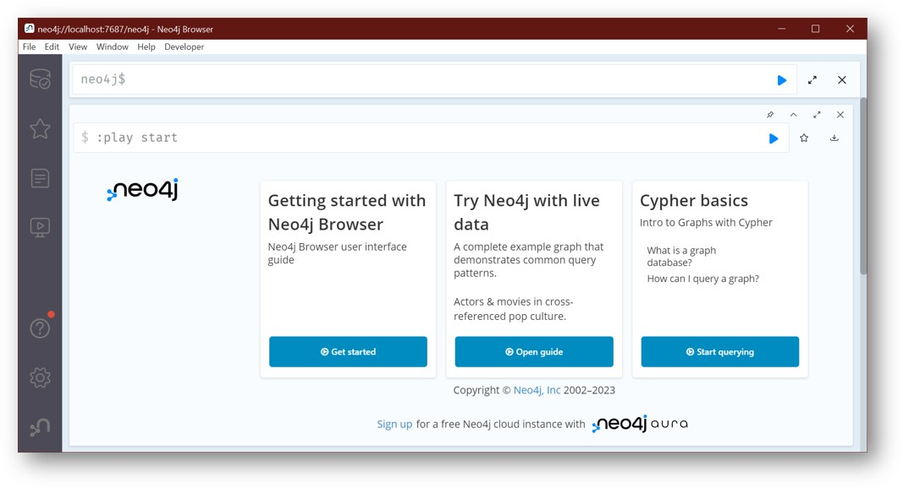
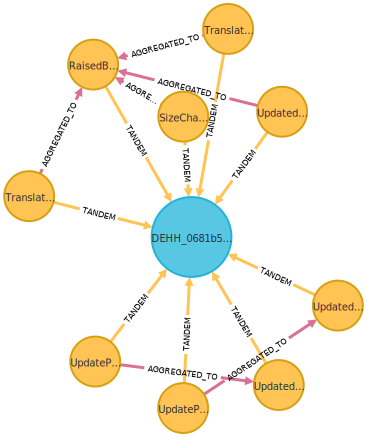
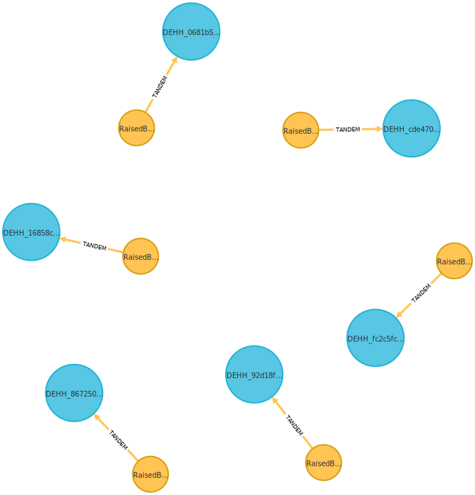
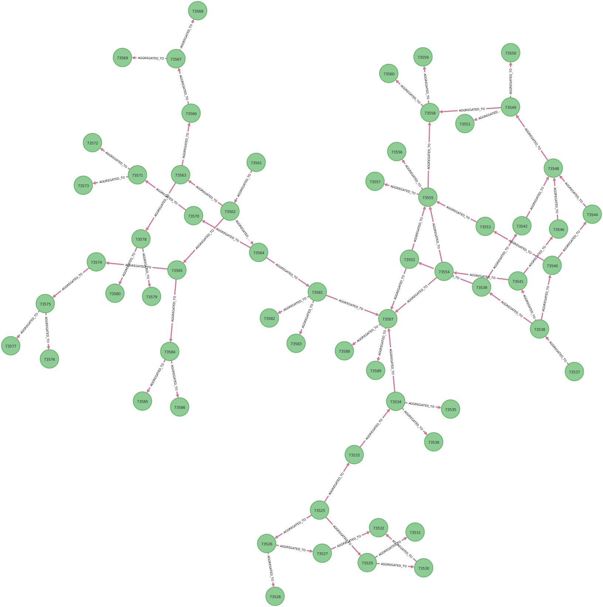
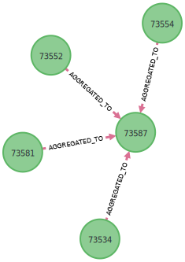
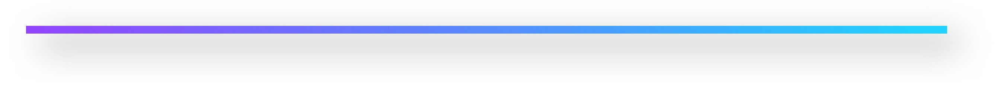

# citymodel-compare

## What it is

A tool to map and match CityGML datasets, as well as interpret their changes, all by using graphs.

+ **MAPPING**: CityGML datasets are represented as **graphs** and stored in the graph database Neo4j. The mapping
  process is very flexible and can support both versions **2.0** and **3.0** of CityGML (as it
  uses [citygml4j](https://github.com/citygml4j/citygml4j)).

+ **MATCHING**: The graph representations of the mapped CityGML datasets are matched based on both their **semantic**
  and
  **geometric** properties. **Spatial indexing** (such as R-Tree) is used to accelerate matching time in massive
  datasets.

+ **INTERPRETING**: The change detection process often results in a high number of low-semantic-level changes. This
  interpretation process **reduces this number**, while simultaneously **increasing the semantic contents** of changes.

The ultimate goal of this tool is to provide a **precise**, **expressive**, and **human-centered** interpretation of
changes in CityGML.

## Contents

+ [How to run it](#how-to-run-it)
+ [How to test it](#how-to-test-it)
+ [How to use my own datasets](#how-to-use-my-own-datasets)
+ [How to define my own pattern rules](#how-to-define-my-own-pattern-rules)
+ [What's next](#whats-next)
+ [How to cite it](#how-to-cite-it)
+ [License](LICENSE)
+ [Contact](#contact)

## How to run it

This tool can be used in two ways: either via Gradle or via Docker. For testing purposes, Docker is recommended.

What is needed:

+ [Docker](https://docs.docker.com/get-docker/)
+ [Neo4j Desktop](https://neo4j.com/download/)

1. Make sure Docker is up and running.

2. Pull the following image from Docker Hub:

   ```shell
   docker pull sonnguyentum/citymodel-compare:1.0.0
   ```
   
   To use latest (experimental) functionalities, pull the following image instead:

   ```shell
    docker pull sonnguyentum/citymodel-compare:1.0.0-dev
    ```

3. Run the image:

   ```shell
   # Linux 
   docker run \
      -it --rm \
      -p 7474:7474 -p 7687:7687 \
   sonnguyentum/citymodel-compare:1.0.0
   ```
   ```shell
   # Windows
    docker run ^
       -it --rm ^
       -p 7474:7474 -p 7687:7687 ^
    sonnguyentum/citymodel-compare:1.0.0
   ```

   This will start a Neo4j instance with all necessary dependencies installed. The parameters are as follows:
    + `-it`: Interactive mode.
    + `--rm`: Remove the container after it exits.
    + `-p 7474:7474`: Expose port 7474 of the container to port 7474 of the host machine. This is the port used by the
      Neo4j browser (such as visualization and inspecting Cypher queries).
    + `-p 7687:7687`: Expose port 7687 of the container to port 7687 of the host machine. This is the port used by the
      Neo4j Bolt connector (such as for RESTful services).

   **Notes**: To simplify the process for testing purposes, the Docker container has already been loaded with
   a test dataset. This dataset includes an older and a newer tiled CityGML dataset of Hamburg, from 2016 and 2022,
   respectively,
   which are publicly available [here](https://metaver.de/trefferanzeige?docuuid=2C1F2EEC-CF9F-4D8B-ACAC-79D8C1334D5E).

   **Notes**: Once started, the datasets will be automatically mapped and matched, and their changes will be interpreted
   and stored in the graph database. All from scratch, no existing Neo4j database instance is contained in the Docker
   container beforehand.
   Please refer to this [section](#how-to-use-my-own-datasets) for more details on how to use your own datasets.

That's it! The old and new CityGML datasets have been mapped, matched, and interpreted. You are now ready to use the
tool.

## How to test it

Now that the tool is up and running, we can test it with a few simple examples. In this section, we will use the
datasets already prepared and available for use in the Docker container.

1. Open Neo4j Desktop, click create new **Remote Datase** and add the following connection details:

   ```shell
   neo4j://localhost:7687
   ```

If requested, the default username and password are both `neo4j`. The following window should appear:



2. In Neo4j Browser, run the following query to count the number of nodes created for the old datasets:

   ```cypher
   MATCH (n:`__PARTITION_INDEX__0`)
   RETURN count(n)
   ```

   ```Cypher
   Result: 35095
   ```

   Similarly, run the following query to count the number of nodes created for the new datasets:

   ```cypher
   MATCH (n:`__PARTITION_INDEX__1`)
   RETURN count(n)
   ```

   ```Cypher
   Result: 35324
   ```

3. To see how many buildings the old dataset has:

   ```cypher
   MATCH (n:`__PARTITION_INDEX__0`:`org.citygml4j.model.citygml.building.Building`) 
   RETURN count(n)
   ```

   ```Cypher
   Result: 46
   ```

   And the new dataset:

   ```cypher
   MATCH (n:`__PARTITION_INDEX__1`:`org.citygml4j.model.citygml.building.Building`)
   RETURN count(n)
   ```

   ```Cypher
   Result: 47
   ```

4. Now, let's see how many literal changes (i.e. on the lowest semantic level) have been detected:

   ```cypher
   MATCH (c:`jgraf.neo4j.diff.Change`)
   WHERE NOT exists((:`jgraf.neo4j.diff.Change`)-[:AGGREGATED_TO]->(c))
   RETURN count(c)
   ```

   ```Cypher
   Result: 2540
   ```

   All changes are labelled with `jgraf.neo4j.diff.Change`. The second line with `WHERE` is used to filter out changes
   on the lowest level, meaning they do not have any incoming interpretation edges from other changes.

5. To count the number of interpretation nodes created from these literal changes:

   ```cypher
   MATCH (c:`jgraf.neo4j.diff.Change`)
   WHERE exists((:`jgraf.neo4j.diff.Change`)-[:AGGREGATED_TO]->(c))
   RETURN count(c)
   ```

   ```Cypher
   Result: 1512
   ```

5. To see how many literal changes have been interpreted:

   ```cypher
   MATCH (c:`jgraf.neo4j.diff.Change`)
   WHERE NOT exists((:`jgraf.neo4j.diff.Change`)-[:AGGREGATED_TO]->(c))
   AND exists((c)-[:AGGREGATED_TO]->(:`jgraf.neo4j.diff.Change`))
   RETURN count(c)
   ```

   ```Cypher
   Result: 723
   ```

   This means that, of the `2540` literal changes, `723`, or `28%`, have been interpreted.

6. To visualize a building and its changes:

   ```cypher
   MATCH paths=(:`__PARTITION_INDEX__0`:`org.citygml4j.model.citygml.building.Building` 
   { id:'DEHH_0681b536-7e9c-478f-b131-0f96d1bc7717' })
   <-[]-(:`jgraf.neo4j.diff.Change`)
   RETURN paths
   ```

   The building and its directly connected changes are shown as follows:

   <p align="center">
   
   </p>

---

As shown in the figure, this roofs of this building have been raised by some amount. The **pattern** includes:

+ The building's `measuredHeight` has been changed by `dh_m > 0`

+ The building's roof surfaces have been translated by `dh_r > 0`

+ The building's ground surfaces have been translated by a small `dh_g` (signed, + is upwards, - is downwards)

+ The building's walls have grown in height by `dh_w > 0`, such that `dh_w = dh_m = dh_r + dh_g`

---

7. To find out how many such buildings with raised roofs have been detected:

   ```cypher
   MATCH (c:`jgraf.neo4j.diff.Change` {change_type: 'RaisedBuildingRoofs'})
   -[]->(b:`org.citygml4j.model.citygml.building.Building`)
   RETURN b, c
   ```

   This query returns `6` buildings:

    <p align="center">
    
    </p>

   The raise margins `dh_m` can be queried as follows:

   ```cypher
   MATCH (c:`jgraf.neo4j.diff.Change` {change_type: 'RaisedBuildingRoofs'})
   RETURN round(toFloat(c.RIGHT_PROPERTY_VALUE) - toFloat(c.LEFT_PROPERTY_VALUE), 3) AS dh_m
   ORDER BY dh_m ASC
   ```

   The sorted results are as follows:

| **Order** | **dh_m (m)** |
|-----------|--------------|
| 1         | 0.008        |
| 2         | 0.05         |
| 3         | 0.12         |
| 4         | 0.188        |
| 5         | 0.251        |
| 6         | 1.025        |

8. To list all rule nodes used for all interpretations:

    ```cypher
    MATCH (r:RULE)
    RETURN r
    ```

   The results are as follows:

   

9. To inspect the rules specifically for raised roofs:

   ```cypher
   MATCH (p)-[]->(r:RULE {change_type:'RaisedBuildingRoofs'})
   RETURN p, r
   ```

   In the figure below, the node in the center represents the rule `RaisedBuildingRoofs`, while the others represent:
    + `UpdatedBuildingMeasuredHeight`
    + `TranslatedBuildingRoofs`
    + `SizeChangedBuildingWalls`
    + `TranslatedBuildingGrounds`

   <div style="text-align: center;">
   
   </div>

10. These rules are defined in Cypher. Please refer to this [Cypher file](scripts/rules_v2.cql) for more details.



## How to use my own datasets

The following steps are required to use your own datasets:

1. Clone this project:

   ```shell
   git clone https://github.com/tum-gis/citymodel-compare
   cd citymodel-compare
   ```

2. Copy your datasets into the `input` directory, such as:

   ```shell
   # Copy old.gml and new.gml into the input directory
   cp /path/to/your/datasets/old.gml input/
   cp /path/to/your/datasets/new.gml input/
   ```

3. Edit file `citygmlv2.conf` in the `config` directory to include these datasets:

   ```shell
   # Input dataset to map onto graphs, can have multiple files/directories
   # If a path is a directory, ALL files in that folder shall be imported as one
   mapper.dataset.paths = [
      "input/old.gml",
      "input/new.gml"
   ]
   ```

   **Notes**:
    + The value `mapper.dataset.paths` can point to either files or directories. If the path is a directory, all files
      in that folder shall be imported as one.
    + The first file in the list is considered the **old** dataset, while the second is the **new** dataset.
    + The file `citygmlv2.conf` is used for CityGML v2.0 datasets. For CityGML v3.0 datasets, edit file
      `citygmlv3.conf` instead.

4. Make sure Docker is up and running.

5. Pull the following image from Docker Hub:

   ```shell
   docker pull sonnguyentum/citymodel-compare:1.0.0
   ```

6. Run the Docker container with bind mounts (make sure you are in the cloned `citymodel-compare` directory):

    ```shell
    # Linux
    docker run \
        -it --rm \
        -p 7474:7474 -p 7687:7687 \
        -v "/path/to/config:/home/gradle/src/citymodel-compare/config" \
        -v "/path/to/input:/home/gradle/src/citymodel-compare/input" \
        -v "/path/to/output:/home/gradle/src/citymodel-compare/output" \
        -v "/path/to/scripts:/home/gradle/src/citymodel-compare/scripts" \
    sonnguyentum/citymodel-compare:1.0.0
    ```

    ```shell
    # Windows
    docker run ^
        -it --rm ^
        -p 7474:7474 -p 7687:7687 ^
        -v "/path/to/config:/home/gradle/src/citymodel-compare/config" ^
        -v "/path/to/input:/home/gradle/src/citymodel-compare/input" ^
        -v "/path/to/output:/home/gradle/src/citymodel-compare/output" ^
        -v "/path/to/scripts:/home/gradle/src/citymodel-compare/scripts" ^
    sonnguyentum/citymodel-compare:1.0.0
    ```

   The parameters are as follows:
    + `-v "/path/to/config:/home/gradle/src/citymodel-compare/config"`: Bind mount the `config` directory of the host
      machine to the `config` directory of the container. This is where the configuration files are stored. Please
      replace `/path/to/config` with the absolute path to the `config` directory of the host machine.
    + `-v "/path/to/input:/home/gradle/src/citymodel-compare/input"`: Bind mount the `input` directory of the host
      machine to the `input` directory of the container. This is where the datasets are stored. Please replace
      `/path/to/input` with the absolute path to the `input` directory of the host machine.
    + `-v "/path/to/output:/home/gradle/src/citymodel-compare/output"`: Bind mount the `output` directory of the host
      machine to the `output` directory of the container. This is where the results are stored, including the Neo4j
      database. Please replace `/path/to/output` with the absolute path to the `output` directory of the host machine.
    + `-v "/path/to/scripts:/home/gradle/src/citymodel-compare/scripts"`: Bind mount the `scripts` directory of the host
      machine to the `scripts` directory of the container. This is where the rule files and other functions are stored.
      Please replace `/path/to/scripts` with the absolute path to the `scripts` directory of the host machine.

## How to define my own pattern rules

The following steps are required to define your own pattern rules:

1. Clone this project:

   ```shell
   git clone https://github.com/tum-gis/citymodel-compare
   cd citymodel-compare
   ```

2. Edit file `scripts/rules_v2.cql` in the `scripts` directory to include your own rules. An example of the file can be
   found [here](scripts/rules_v2.cql). The rules are defined using
   Neo4j's [Cypher Query Language](https://neo4j.com/developer/cypher/).

   The rules contain nodes and edges. The nodes are labelled with `RULE` and the edges are labelled
   with `AGGREGATED_TO`. Each node and edge can have properties (see tables below).

3. Make sure Docker is up and running.

4. Pull the following image from Docker Hub:

   ```shell
   docker pull sonnguyentum/citymodel-compare:1.0.0
   ```

5. Run the Docker container with bind mounts (make sure you are in the cloned `citymodel-compare` directory):

    ```shell
    # Linux
    docker run \
        -it --rm \
        -p 7474:7474 -p 7687:7687 \
        -v "/path/to/config:/home/gradle/src/citymodel-compare/config" \
        -v "/path/to/input:/home/gradle/src/citymodel-compare/input" \
        -v "/path/to/output:/home/gradle/src/citymodel-compare/output" \
        -v "/path/to/scripts:/home/gradle/src/citymodel-compare/scripts" \
    sonnguyentum/citymodel-compare:1.0.0
    ```

    ```shell
    # Windows
    docker run ^
        -it --rm ^
        -p 7474:7474 -p 7687:7687 ^
        -v "/path/to/config:/home/gradle/src/citymodel-compare/config" ^
        -v "/path/to/input:/home/gradle/src/citymodel-compare/input" ^
        -v "/path/to/output:/home/gradle/src/citymodel-compare/output" ^
        -v "/path/to/scripts:/home/gradle/src/citymodel-compare/scripts" ^
    sonnguyentum/citymodel-compare:1.0.0
    ```

   The parameters are as follows:
    + `-v "/path/to/config:/home/gradle/src/citymodel-compare/config"`: Bind mount the `config` directory of the host
      machine to the `config` directory of the container. This is where the configuration files are stored. Please
      replace `/path/to/config` with the absolute path to the `config` directory of the host machine.
    + `-v "/path/to/input:/home/gradle/src/citymodel-compare/input"`: Bind mount the `input` directory of the host
      machine to the `input` directory of the container. This is where the datasets are stored. Please replace
      `/path/to/input` with the absolute path to the `input` directory of the host machine.
    + `-v "/path/to/output:/home/gradle/src/citymodel-compare/output"`: Bind mount the `output` directory of the host
      machine to the `output` directory of the container. This is where the results are stored, including the Neo4j
      database. Please replace `/path/to/output` with the absolute path to the `output` directory of the host machine.
    + `-v "/path/to/scripts:/home/gradle/src/citymodel-compare/scripts"`: Bind mount the `scripts` directory of the host
      machine to the `scripts` directory of the container. This is where the rule files and other functions are stored.
      Please replace `/path/to/scripts` with the absolute path to the `scripts` directory of the host machine.

### Node properties

| **Property**  | **Description**                                                                                                                                                                                                                                                                                                                                                                                      | **Mandatory** |
|---------------|------------------------------------------------------------------------------------------------------------------------------------------------------------------------------------------------------------------------------------------------------------------------------------------------------------------------------------------------------------------------------------------------------|---------------|
| `change_type` | The type of current change                                                                                                                                                                                                                                                                                                                                                                           | Yes           |
| `calc_scope`  | Directive to calculate scope over this type of changes. For example, `calc_scope="p1;p2;p3"` will calculate scope based on all changes with the same `change_type` and have the same values of `p1`, `p2`, `p3`. The current implementation allows for fuzzy comparison of numeric and date-time values. For instance, `1.0001` and  `1.000` may be considered equal for error tolerance of `0.001`. | No            |
| `tags`        | Tags for the current change. For example, `tags="update;thematic;toplevel"` will add indications to categorize this change as an update of thematic properties that belong to a top-level feature.                                                                                                                                                                                                   | No            |

### Edge properties

| **Property**        | **Description**                                                                                                                                                                                                                                                                                                                                                                                                                                                                                                                                                                                                                                                                                                                                                                                                                                                                                                | **Mandatory** |
|---------------------|----------------------------------------------------------------------------------------------------------------------------------------------------------------------------------------------------------------------------------------------------------------------------------------------------------------------------------------------------------------------------------------------------------------------------------------------------------------------------------------------------------------------------------------------------------------------------------------------------------------------------------------------------------------------------------------------------------------------------------------------------------------------------------------------------------------------------------------------------------------------------------------------------------------|---------------|
| `next_content_type` | The type of the target content node. This is used by the interpreter while navigating within the content network.                                                                                                                                                                                                                                                                                                                                                                                                                                                                                                                                                                                                                                                                                                                                                                                              | Yes           |
| `search_length`     | Specify the maximum length the interpreter should traverse to reach target nodes of `next_content_type`.                                                                                                                                                                                                                                                                                                                                                                                                                                                                                                                                                                                                                                                                                                                                                                                                       | No            |
| `not_contains`      | Specify the content type that should not be included while travering to the target content node. If a content node of this `not_contains` is encountered, the interpreter shall exit. For example, `not_contains` can be used to distinguish changes that belong to a building part or a building.                                                                                                                                                                                                                                                                                                                                                                                                                                                                                                                                                                                                             | No            |
| `name`              | Give a name to the current change. This is needed for joining multiple converging rule edges that are required to create the next interpreted change. The `join` conditions require ALL converging rule edges to have a unique `name`.                                                                                                                                                                                                                                                                                                                                                                                                                                                                                                                                                                                                                                                                         | No            |
| `join`              | Conditions for joining converging rule edges. Conditions are given in JavaScript syntax. For example, the join conditions `fuzzyEquals(parseFloat(rule_measured_height.RIGHT_PROPERTY_VALUE) - parseFloat(rule_measured_height.LEFT_PROPERTY_VALUE), rule_size_changed_walls.z) && fuzzyEquals(rule_translated_roofs.z, parseFloat(rule_size_changed_walls.z) + parseFloat(rule_translated_grounds.z))` takes the properties `LEFT_PROPERTY_VALUE` and `RIGHT_PROPERTY_VALUE` of change named `rule_measured_height`, as well as property `z` of `rule_translated_roofs` and `rule_size_changed_walls` and `rule_translated_grounds`. The function `fuzzyEquals(a, b)` is pre-defined and can be freely used to test whether two strings `a` and `b` are numerically equal, with error tolerance taking into account. The function `parseFloat(a)` is available in JavaScript to convert a string to a number. | No            |
| `scope`             | Test whether the current change belong to a scoped change. There are two values: `clustered`, and `global`. If `scope` is used, `weight` can be omitted. Note: scopes are only calculated for changes that belong to top-level features.                                                                                                                                                                                                                                                                                                                                                                                                                                                                                                                                                                                                                                                                       | No            |
| `conditions`        | Conditions for the creation of the next (interpreted) change. The conditions are given in JavaScript syntax and must be evaluated to `true` or `false`. Properties of the current change node can also be used. For instance, `PROPERTY_NAME === "measuredHeight" && fuzzyEquals(RIGHT_PROPERTY_VALUE - LEFT_PROPERTY_VALUE, 1.0)` can be used to determine whether the current change is an updated `measuredHeight`, and whether the new value is greater than the old value by `1.0`. The function `fuzzyEquals(a, b)` is pre-defined and can be freely used to test whether two strings `a` and `b` are numerically equal, with error tolerance taking into account.                                                                                                                                                                                                                                       | No            |
| `propagate`         | Directive to propagate the properties of the current change to the next (interpreted) change. For instance, `propagate="p1;p2;p3"` will propagate the properties `p1`, `p2`, and `p3`.                                                                                                                                                                                                                                                                                                                                                                                                                                                                                                                                                                                                                                                                                                                         | No            |
| `weight`            | Determine the number of occurrences of the current changes required for the creation of the next interpreted change. For example, `weight=5`. If the weight value is not known beforehand, the placeholder `*` can be used, such as `weight=*`. This placeholder shall be updated with a concrete value the interpreter during runtime.                                                                                                                                                                                                                                                                                                                                                                                                                                                                                                                                                                        | No            |

### Pre-defined functions

Since `conditions` and `join` can be given in JavaScript syntax, pre-defined functions, JavaScript functions, and other
JavaScript syntax can be used. The following pre-defined functions are available:

| **Function**          | **Description**                                                                                              |
|-----------------------|--------------------------------------------------------------------------------------------------------------|
| `fuzzyEquals(a, b)`   | Test whether two strings `a` and `b` are numerically equal, with error tolerance taking into account.        |
| `spatialEquals(a, b)` | Test whether two geometries `a` and `b` are spatially equivalent, with error tolerances taking into account. |

Other JavaScript functions can be used as well. For example, `Math.abs(a)` can be used to get the absolute value of `a`,
or `parseFloat(a)` can be used to convert a string `a` to a number.

The pre-defined functions are defined in JavaScript in the file [functions.js](scripts/functions.js). This file is read
by the interpreter during runtime, thus you can define your own functions here and use them in `conditions` or `join`.

## What's next

The following features will be added soon:

+ The ability to **run** the mapping, matching, and interpretation processes separately.


## How to cite it

This tool is part of the following publications:

**Nguyen, Son H.; Kolbe, Thomas H.**: [_Identification and Interpretation of Change Patterns in 
Semantic 3D City Models_](https://mediatum.ub.tum.de/doc/1730733/1730733.pdf). Lecture Notes in Geoinformation and Cartography - Recent Advances in 3D Geoinformation Science - 
Proceedings of the 18th 3D GeoInfo Conference, Springer, 2023.

**Nguyen, Son H.; Kolbe, Thomas H.**: [_Path-tracing Semantic Networks to Interpret Changes in Semantic 3D City
Models_](https://www.isprs-ann-photogramm-remote-sens-spatial-inf-sci.net/X-4-W2-2022/217/2022/).
Proceedings of the 17th International 3D GeoInfo Conference 2022 (ISPRS Annals of the Photogrammetry, Remote Sensing and
Spatial Information Sciences), ISPRS, 2022.

**Nguyen, Son H.; Kolbe, Thomas H.**: [_Modelling Changes, Stakeholders and their Relations in Semantic 3D City
Models_](https://www.isprs-ann-photogramm-remote-sens-spatial-inf-sci.net/VIII-4-W2-2021/137/2021/).
Proceedings of the 16th International 3D GeoInfo Conference 2021 (ISPRS Annals of the Photogrammetry, Remote Sensing and
Spatial Information Sciences), ISPRS, 2021, 137-144.

**Nguyen, Son H.; Kolbe, Thomas H.**: [_A Multi-Perspective Approach to Interpreting Spatio-Semantic Changes of Large 3D
City
Models in CityGML using a Graph
Database_](https://www.isprs-ann-photogramm-remote-sens-spatial-inf-sci.net/VI-4-W1-2020/143/2020/). Proceedings of the
15th International 3D GeoInfo Conference 2020 (ISPRS
Annals
of the Photogrammetry, Remote Sensing and Spatial Information Sciences), ISPRS, 2020, 143–150.

**Nguyen, Son H.; Yao, Zhihang; Kolbe, Thomas H.**: [_Spatio-Semantic Comparison of Large 3D City Models in CityGML
Using
a Graph
Database_](https://gispoint.de/artikelarchiv/gis/2018/gisscience-ausgabe-32018/4612-raeumlich-semantischer-vergleich-grosser-3d-stadtmodelle-in-citygml-unter-verwendung-einer-graph-datenbank.html).
gis.Science (3/2018), 2018, 85-100.

**Nguyen, Son H.; Yao, Zhihang; Kolbe, Thomas H.**: [_Spatio-Semantic Comparison of Large 3D City Models in CityGML
Using a Graph Database_](https://mediatum.ub.tum.de/doc/1425153/1425153.pdf). Proceedings of the 12th International 3D
GeoInfo Conference 2017 (ISPRS Annals of the Photogrammetry, Remote Sensing and Spatial Information Sciences), ISPRS,
2017, 99-106.

**Nguyen, Son H.**: [_Spatio-semantic Comparison of 3D City Models in CityGML using a Graph
Database_](https://mediatum.ub.tum.de/doc/1374646/1374646.pdf). Master thesis, 2017.

## License

This project is licensed under the MIT License - see the [LICENSE](LICENSE) file for details.

## Contact

If you have any questions or suggestions, please contact:

**Son H. Nguyen, M.Sc.**

**_PhD Candidate, Research Associate_**

Chair of Geoinformatics | Department of Aerospace and Geodesy

TUM School of Engineering and Design | Technical University of Munich (TUM)

Arcisstr. 21, 80333 Munich, Germany

Email: [son.nguyen@tum.de](mailto:son.nguyen@tum.de)

[Homepage](https://www.asg.ed.tum.de/en/gis/our-team/staff/son-h-nguyen/) | [LinkedIn](https://www.linkedin.com/in/son-h-nguyen/) | [ResearchGate](https://www.researchgate.net/profile/Son-Nguyen-101)


